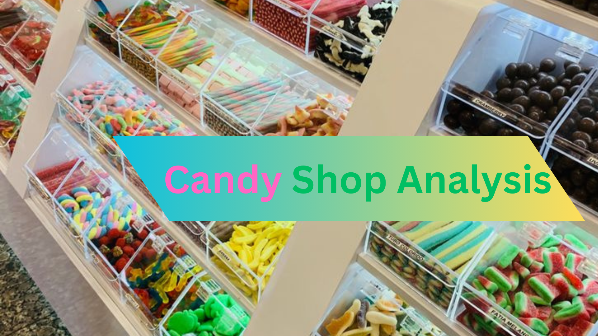
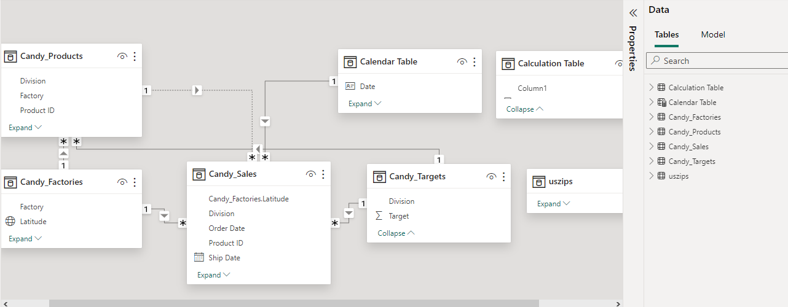
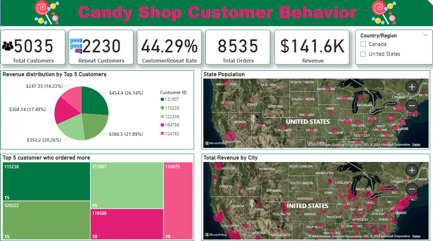
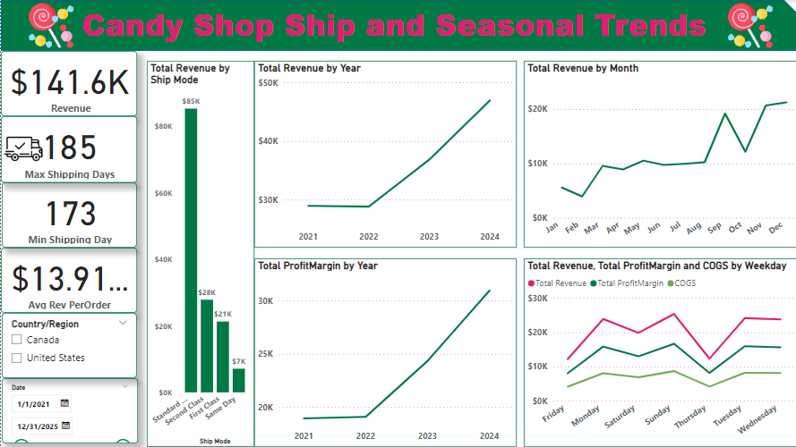

## CANDY SALES ANALYTICS

## Project Overview
This report analyzes customer behavior, factory performance, and shipping trends for a candy distributor. It explores key metrics such as revenue, repeat customer rate, shipping times, and product division performance. Insights were derived from sales data spanning multiple years, with a focus on understanding customer preferences, factory revenue contribution, and the impact of shipping and seasonality on business performance.

## Objective
The primary objective of this report is to provide a comprehensive analysis of the candy shop’s sales performance. It aims to:

Identify key customer behavior patterns.

Evaluate factory performance and product division contributions.

Analyze shipping trends and their impact on sales.

Highlight seasonal trends that influence revenue generation.

## Methodology
The analysis was conducted using Power BI, where data from various tables was integrated to develop visual dashboards. The main tools used include DAX calculations for metrics such as repeat customer rate, shipping days, and revenue performance by region and product.

## Data Overview/Source
The dataset comprises six main tables:

Sales Table: Contains order details such as Order ID, Ship Date, Customer ID, and revenue.

Factories Table: Provides information on factories, including factory names and geolocation data.

Products Table: Lists product details, including division, price, and cost.

Targets Table: Displays sales targets for the year 2024 across divisions.

US Zips Table: Contains zip code information, including population density and geographic coordinates.

Calendar Table: Provides a time-based dimension used for calculating metrics like shipping days and monthly trends.

## Data Preparation
Data cleaning involved the following steps:

Identifying and correcting outliers in the shipping date column (e.g., replacing 2026-2029 dates with appropriate years).
Merging the factory and product tables with the sales table for a complete view of sales by product and factory.
Cleaning and transforming the US Zips table to remove irrelevant information and ensure accuracy for location-based analysis.

## Data Modeling

Customer Behavior: The sales table was used to analyze repeat customers and overall order count. Key metrics such as total customers, repeat customer rate, and total revenue were calculated using DAX functions.

Factory and Product Analysis: Factories were assessed by revenue contribution, while products were analyzed based on their sales performance. The merged table helped identify which products and factories generated the highest revenue.

Shipping and Seasonal Trends: Using the shipping date and order date, a DAX function was created to calculate shipping duration. Seasonal trends were identified by analyzing sales by month and year.

##  Observations
Customer Behavior:

The candy shop has a total of 5,035 customers, with 2,230 being repeat customers, leading to a 44.29% repeat customer rate.
A total of 8,535 orders were processed, generating $141.60k in revenue.
The top 5 customers placed the most orders, with the highest order count being 15.

Factory and Product Performance:

There are five factories, with Lot's O' Nuts contributing the highest revenue ($76,198.13), followed by Wicked Choccy's ($55,309.25).
Chocolate products dominated sales, contributing 92.87% of the total revenue, while sugar-based products generated minimal sales.
The Wonka Bar - Triple Dazzle Caramel was the best-selling product, contributing $28,451.25 to the revenue.

Shipping and Seasonal Trends:

The maximum shipping duration was 185 days, with a minimum of 173 days.
Standard class shipping was the most preferred method, contributing 60.26% of revenue.
Sales peaked in December, while February witnessed a dip, indicating the impact of seasonality on revenue.

## Conclusion
This analysis reveals that the candy shop is performing well, especially in the chocolate product division, which accounts for the vast majority of its revenue. However, there are areas for improvement, such as optimizing shipping times and adjusting the product mix to focus on high performers. The shop's strong customer loyalty offers an excellent opportunity to deepen relationships with repeat customers through targeted marketing campaigns. Lastly, aligning promotional efforts with seasonal trends and geographical insights will help the candy shop maximize its growth potential and sustain long-term success.

## Recommendations
Focus on High-Performing Product Divisions:

With chocolate contributing 92.87% of total revenue, the company should prioritize this division in its marketing and production strategies. Expanding the chocolate product line or offering variations of top sellers like the Wonka Bar series could drive further growth.
Optimize Shipping Efficiency:

The extended shipping times (maximum of 185 days) could negatively impact customer satisfaction. Consider reviewing and optimizing logistics to reduce shipping times, especially for popular shipping modes like Standard Class, which generates 60.26% of revenue.
Leverage Customer Insights for Targeted Marketing:

With a 44.29% customer repeat rate, it’s clear that customer loyalty is strong. Strategic promotions, loyalty programs, and personalized offers should be targeted at repeat customers to further increase their order frequency.
Target high-population cities like Brooklyn, Chicago, and Houston for new customer acquisition campaigns, as these areas present significant growth opportunities.
Align Product Targets with Sales Trends:

The candy shop has exceeded its revenue targets for chocolates, while the sugar division significantly underperformed. Reassess sales targets and potentially scale back underperforming products like sugar-based candies. A focus on diversifying the chocolate range may yield better results than investing in low-performing divisions.
Capitalize on Seasonal Trends:

December consistently shows the highest sales, while February sees a dip. Implement promotional campaigns in low-sales months (e.g., February) to balance revenue streams throughout the year. Focus heavily on maximizing December sales through holiday-themed products and discounts.

