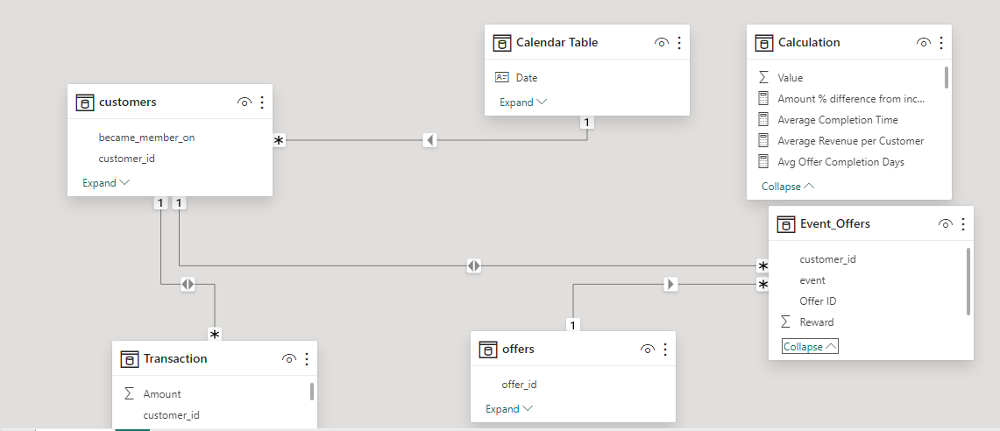

## MARVEN_ANALYTICS_CHALLENGE

## Cafe Reward Analysis

## Project Objective
This report analyzes marven Cafe Reward, focusing on customer behaviour, offer effectiveness and revenue generation. Using data from customer demographics, offer details and acivity records. The objective is to identify key customer segment and develop a data driven strategy for future promotional messaging and targeting. 

## Methodology

The data used in this analysis was sourced from three CSV files:

Customer Data: Contains demographic information, including customer ID, age, gender, income, and membership details.

Offer Data: Details of the offers sent to customers, including offer ID, type, difficulty, reward, duration, and channels used.

Event Data: Records customer activities related to offers, including transactions, offers received, viewed, and completed.

The dataset consists of 306,534 records and 14 fields, providing a comprehensive view of customer interactions with the Maven Cafe Rewards Program.

## Data Preparation
The data was loaded into Power BI for cleaning and transformation:

Age Grouping: The age field in the customer table was grouped into four categories: Young Adults (18-35), Matured Adults (36-54), Seniors (55-69), and Elderly (70+).

Data Cleansing: Blank values in the age field were replaced with "Nil," and blanks in value columns were replaced with zeros. Further cleansing involved trimming and capitalizing words for consistency.

Table Adjustments: The event table was dissected, adjusted, and appended to fit other tables, resulting in four final tables: Customer, Offer Event, Offer, and Transaction.

Calculated Measures: DAX (Data Analysis Expressions) was used to create custom calculations, including total rewards, churn rate, and transaction-related measures.

## Data Modeling
The data modeling process involved connecting the tables using one-to-many relationships, with offer ID and customer ID as the primary keys. This structure enabled the integration of different datasets, allowing for a cohesive analysis of customer behavior, offer performance, and transaction data.

A calendar table was also created to facilitate time-based analysis, enabling the correlation of events with specific time periods.

