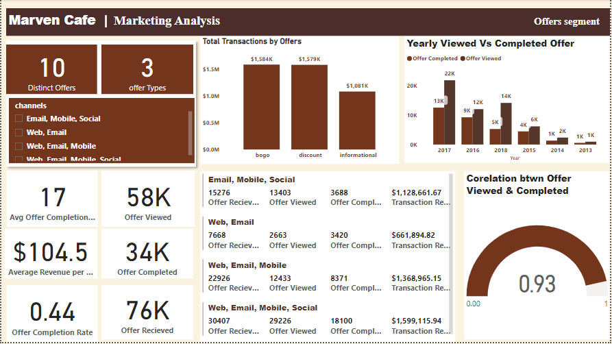
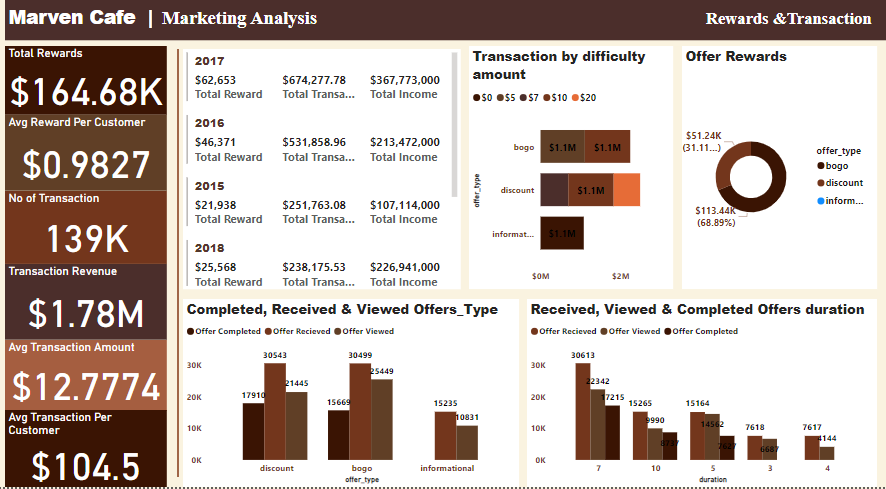

## MARVEN_ANALYTICS_CHALLENGE

## Cafe Reward Analysis

## Project Objective
This report analyzes marven Cafe Reward, focusing on customer behaviour, offer effectiveness and revenue generation. Using data from customer demographics, offer details and acivity records. The objective is to identify key customer segment and develop a data driven strategy for future promotional messaging and targeting. 

## Methodology

The data used in this analysis was sourced from three CSV files:

Customer Data: Contains demographic information, including customer ID, age, gender, income, and membership details.

Offer Data: Details of the offers sent to customers, including offer ID, type, difficulty, reward, duration, and channels used.

Event Data: Records customer activities related to offers, including transactions, offers received, viewed, and completed.

The dataset consists of 306,534 records and 14 fields, providing a comprehensive view of customer interactions with the Maven Cafe Rewards Program.

## Data Preparation
The data was loaded into Power BI for cleaning and transformation:

Age Grouping: The age field in the customer table was grouped into four categories: Young Adults (18-35), Matured Adults (36-54), Seniors (55-69), and Elderly (70+).

Data Cleansing: Blank values in the age field were replaced with "Nil," and blanks in value columns were replaced with zeros. Further cleansing involved trimming and capitalizing words for consistency.

Table Adjustments: The event table was dissected, adjusted, and appended to fit other tables, resulting in four final tables: Customer, Offer Event, Offer, and Transaction.

Calculated Measures: DAX (Data Analysis Expressions) was used to create custom calculations, including total rewards, churn rate, and transaction-related measures.

## Data Modeling

The data modeling process involved connecting the tables using one-to-many relationships, with offer ID and customer ID as the primary keys. This structure enabled the integration of different datasets, allowing for a cohesive analysis of customer behavior, offer performance, and transaction data.

A calendar table was also created to facilitate time-based analysis, enabling the correlation of events with specific time periods.

## Visualization and Observations
The analysis was divided into three key areas: customer behavior, offer analysis, and reward and transaction performance.

Customer Behavior:

Maven Cafe experienced a steady increase in customer numbers over time, particularly in 2017 and 2018, which contributed to higher revenue and sales.
Seasonal trends indicate that sales peak in August, October, and December, potentially due to weather or seasonal factors.
Despite having 5056 customers in the 70-118 age bracket, this group generates only 21% of the total income. In contrast, the 55-69 age group, with 4801 customers, contributes 34.86% of the income, while the 36-54 group generates 31.54%, and the 18-36 group accounts for 12.45%.

Offer Segment Analysis:

The cafe offers 10 distinct offers categorized as Bogo, Information, and Discount, promoted through four primary channel groups. The Web, Email, Mobile, Social group emerged as the most effective.
A total of 76,000 offers were received, 58,000 were viewed, and 34,000 were completed. The correlation between offers viewed and completed is strong at 0.93.
In 2017, the highest number of offers were viewed (21,925) and completed (12,595), reflecting the success of that year's promotional strategies.
Detailed analysis shows that no Information offers were completed, despite 15,235 being received and 10,831 being viewed. Conversely, 17,910 Discount offers were completed from 30,543 received, and 15,669 Bogo offers were completed from 30,499 received.

Reward and Transaction Dashboard Analysis:

The total rewards generated amounted to $164.68k, with an average reward per customer of $0.9827.
A total of 139k transactions were recorded, generating $178m in revenue. The average transaction amount was $12.7774, and the average transaction per customer was $104.5.
Over the years, 2017 topped the chart in total rewards, transactions, and income generated, as represented visually in the dashboards.
The Bogo offer type saw the highest completion rate, with 113,440 rewards completed (68.89%), followed by Discount offers with 51,236 rewards completed (31.11%). No rewards were completed for the Information offer type.
The difficulty amount, required to complete an offer, was analyzed across five levels: $0, $5, $7, $10, and $20, tied to different offer types. The performance of these difficulty levels was also visualized.
Offers tied to longer durations (e.g., 7 days) saw higher completion rates and transaction volumes, with 30,613 offers received, 22,342 viewed, and 17,215 completed.
Conclusion

